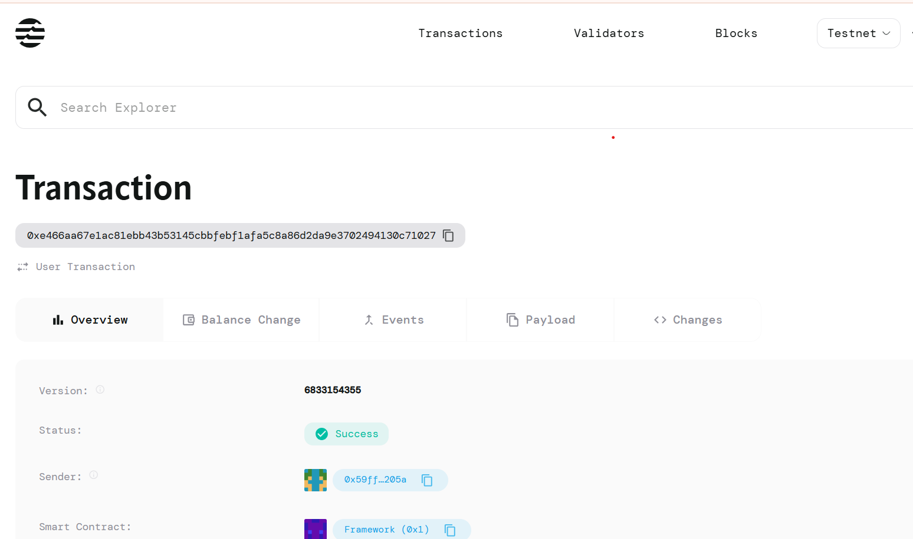

# NFT Breeding Contract

## Project Description
This smart contract implements genetic algorithms for breeding new NFTs from parent NFTs on the Aptos blockchain. Users can create genesis NFTs with unique genetic traits and breed them together to produce offspring with combined characteristics, creating an evolutionary NFT ecosystem where each generation inherits traits from its ancestors.

## Project Vision
Our vision is to revolutionize the NFT space by introducing biological-inspired breeding mechanisms that create truly unique and evolving digital assets. We aim to build a decentralized genetic ecosystem where NFTs can reproduce, evolve, and develop rare traits through generations, making each NFT a living digital organism with its own hereditary lineage.

## Key Features
- **Genetic Algorithm Implementation**: Advanced breeding system using crossover techniques to combine parent traits
- **Generation Tracking**: Each NFT maintains its generation level and parent lineage
- **DNA Storage**: Unique genetic code stored as byte vectors for each NFT
- **Parent Heritage**: Complete family tree tracking with parent IDs
- **Genesis Creation**: Ability to create founding NFTs with custom genetic traits
- **Evolutionary Breeding**: Offspring inherit mixed characteristics from both parents
- **Gas Efficient**: Optimized Move language implementation for minimal transaction costs
- **Secure & Transparent**: All breeding operations are verifiable on the Aptos blockchain

## Future Scope
### Phase 1 (Current)
- Basic breeding functionality with genetic crossover algorithms
- Genesis NFT creation and parent tracking system

### Phase 2 (Next Quarter)
- Advanced genetic mutations during breeding process
- Rarity calculation based on genetic combinations
- Breeding cooldown periods and energy systems
- Web interface for easy NFT breeding and visualization

### Phase 3 (Long-term)
- Multi-trait genetic systems (color, size, attributes, etc.)
- Genetic marketplace for trading breeding rights
- Tournament systems based on genetic superiority
- Cross-breeding compatibility with other NFT collections

### Phase 4 (Extended Vision)
- AI-powered genetic prediction algorithms
- Virtual ecosystem simulation for NFT habitats
- Genetic research labs for trait discovery
- Metaverse integration for interactive breeding experiences
- DAO governance for evolutionary rule changes

## Contract Details
0x2ebedf5f328adf5e650ec83f33d2d90b59f1748d262fe1dfc94636c33c740edb

